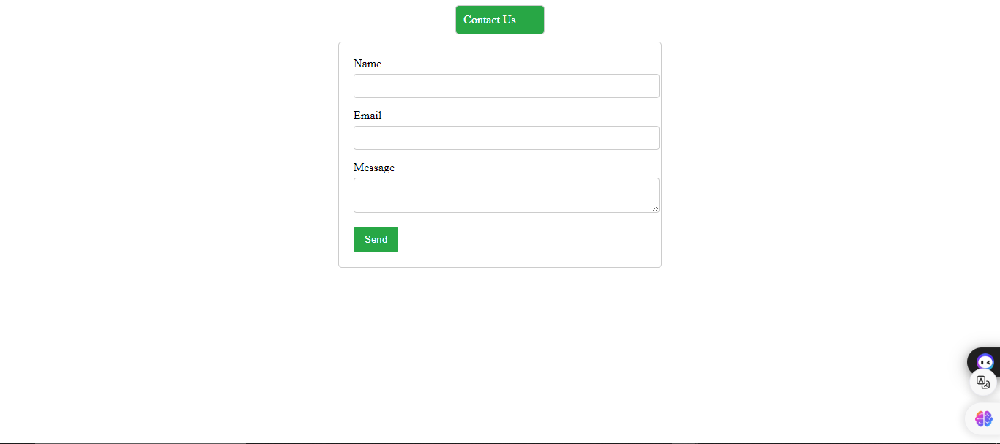
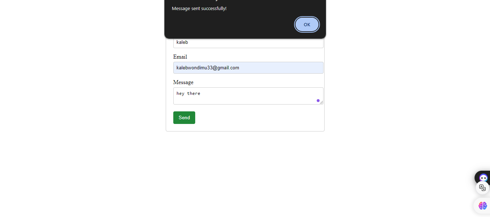
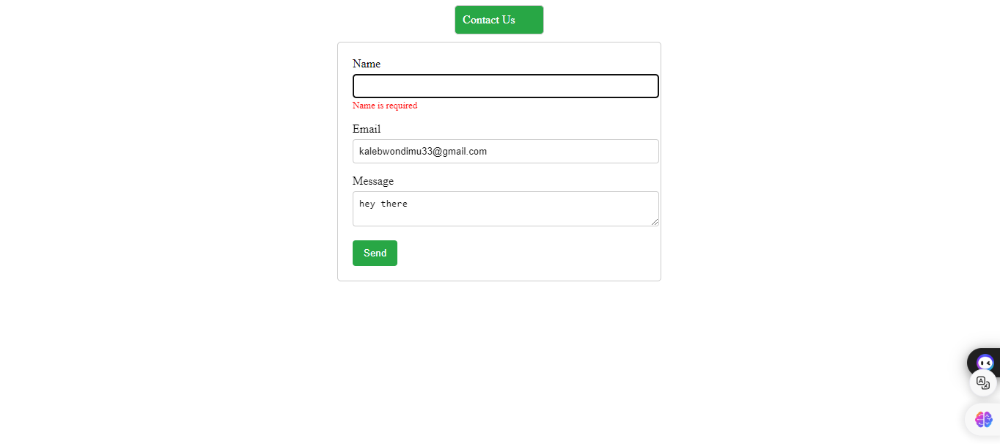
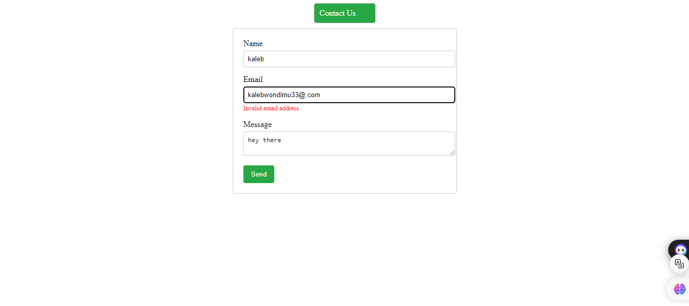

# Contact Form

This is a simple contact form built using React and the `useForm` hook. The form includes fields for name, email, and message, with validation for required fields and proper email format.

## Technologies Used

- React
- react-hook-form

## Setup

1. Clone the repository
2. Install dependencies using `npm install`
3. Run the application using `npm run dev`

## Usage

Fill in the form fields and submit to see the data logged in the console.

## Screen shoot

The above image shows the home page

The above image shows the sucess message that the users got when they submit valid data

The above image shows the user to put the name in the name feild

The above image shows the user to put the correct email format
